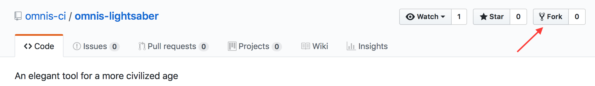
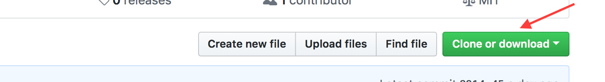
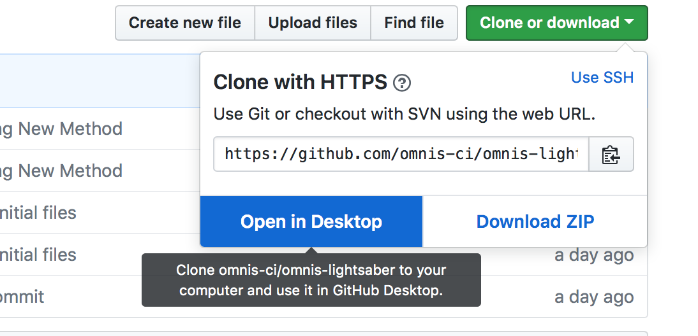
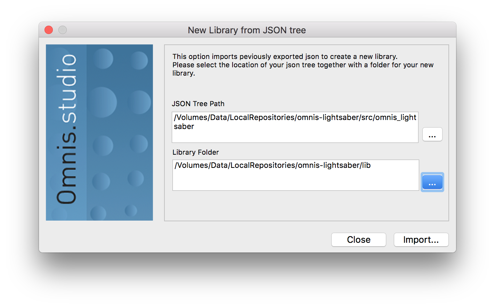
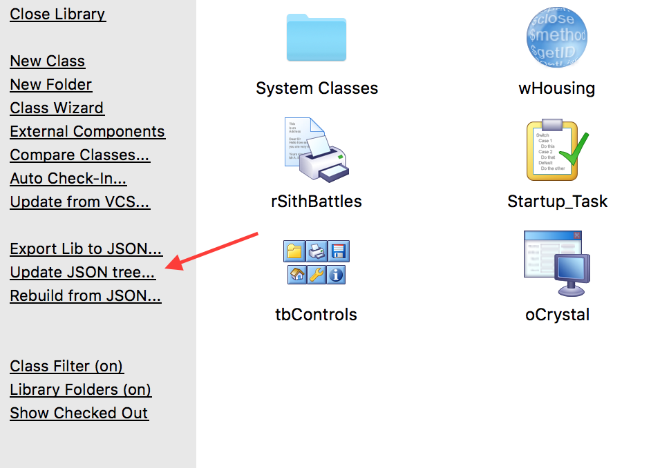

GitHub is built for collaboration and offers a well-defined practice for contributing changes to someone else's code. This process works very well with the JSON export in Omnis Studio 8.1, and this guide will walk you through this process.

## Overview
Contributing to someone else's repository on GitHub usually follows these steps:
1. Copy, or fork, their repository for your changes
1. Download, or clone, your copy of the repository
1. Import their code
1. Add your changes to their code
1. Commit your changes to your copy of the repository
1. Push your changes back to your fork
1. Ask the repository's owner to merge your changes back into the original repository

# Prerequisites
* Omnis Studio 8.1 or later
* GitHub Client

## Fork the repository
Unless a repository's owner grants you permission, you cannot modify their repository directly. Instead, you make a copy of their repository and modify that copy. This copy is called a **fork** and has two unique properties.

1. The fork is owned by you.
1. The fork is linked to the original repository.

Each of these properties provides a specific benefit:

1. Because you own the fork, you can make any change you like to it.
1. Because the fork is linked to the original, GitHub makes it easy to share changes in the fork back to the original repository. This sharing process is called a **Pull Request** and is explained below.

### How to fork a repository on GitHub
1. Go on GitHub to the repository to be forked.
1. Click on the button **Fork**.

## Clone forked repository
Once you have the fork, you need to clone the fork to your local computer to get the (JSON) source. Follow these steps to clone your fork using the GitHub Desktop app.

1. Navigate to your fork on github.com.
1. Click on the green button **Clone / Download**. 

1. A popup appears. Click **Open in Desktop**. 

1. You will be prompted permission to open the GitHub app. Click **Allow**.
1. The GitHub app opens with a window **Clone a Repository**. 

1. (Optional) You can change the folder in which the repository will be cloned. Click on **Choose** to correct this.
1. Click on **Clone**. 

## Import Library into Omnis
Next you can create a library from the source in your local copy of the fork using Omnis Studio.

1. Open Omnis Studio.
1. Click in the Studio browser on **New Lib From JSON**.

1. Click on the **...** button next to 'JSON Tree Path'.

1. Go to the folder in the repository where the file library.json resides and click on **Choose**.
1. Click on the **...** button next to **Library Folder** and choose a folder where the Library has to be created.
1. Click on **Import...**. If there are any errors occuring check the 
[Troubleshooting](#errors-at-importing-and-exporting-libraries) section below for more information.

## Update forked repository
Make your changes directly in the library you imported. When you're satisfied with those changes and want to share them back to the original repository, they first need to be added and uploaded (pushed) to the forked repository.

### Update JSON tree
Click **Update JSON tree** in the Studio Browser. This will export the changed Omnis code to JSON.

### Commit and push to forked repository
Use the GitHub app to commit and push the changes to the fork repository with the steps below

1. Open the forked repository in the GitHub app
1. Review your changes and enter a summary and a description and click 'Commit to master'.

1. Click on 'Push to origin' to upload the changes to repository on GitHub.

## Create pull request
The final step is to notify the owner of the original repository that you have made changes and want them to be merged into their repository. This notification is called a **Pull Request** because you're ___requesting___ that the repository's maintainer ___pull___ your changes back to the source.

1. In the GitHub app click on the menu **Branch** and then on **Create pull request**. This opens GitHub in the browser (If menu option is grayed out. See [Troubleshooting](#unable-to-create-pull requests) section).

1. Click **Create pull request**.

1. Enter a descripton for the pull request.
1. And click **Create pull request**.
1. It is now to the owner of the original repository to descide if he accepts the changes. See the [About pull requests](https://help.github.com/articles/about-pull requests/) documentation of GitHub for more informtion.

## Troubleshooting
### Errors at importing and exporting libraries
#### Output Library already exists
Most likely the choosen folder for the libary is the same as the one cloned from the forked repository. Either rename the existing library, remove it or choose another folder.

#### Import requires external library to be open
This means the library to be exported / imported is dependent on another library. Resovle this by first opening/importing the other library in Omnis Studio, then import the dependent library.

#### Unable to create pull requests
If the menu line 'Create pull requests' is grayed out, then probably the repository is added as a local repository to the app. To enable the 'Create pull requests' menu line the repository has to be cloned from GitHub from within the GitHub app.
[../images/fork_repository.png]: 
(../images/os-new_lib_json.png): 